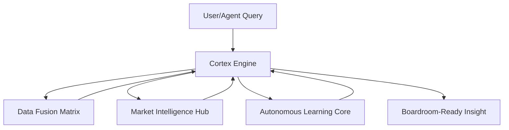

# Neural Business Mirroring Core – AI-Driven Microservice Blueprint

This file documents the auto-generated architecture and code patterns for the "Neural Business Mirroring Core": the central AI microservice that mirrors a customer’s business, delivers boardroom-grade insights, and continuously learns from both internal and external signals.

---

## 1. **Purpose and Role**
- **Primary Function:**  
  Serve as the AI "brain" that understands, analyzes, and narrates a company’s unique business state, competitive context, and optimal actions.
- **Core Capabilities:**  
  - Ingest raw queries from users or other agents  
  - Fuse 100+ data sources (internal & external)  
  - Run deep analysis (trends, anomalies, opportunity/risk)  
  - Synthesize findings into actionable, executive-ready outputs  
  - Learn and adapt from feedback and real-world outcomes

---

## 2. **High-Level Architecture**



---

## 3. **Microservice Components**

### a) Cortex Engine

```python name=services/cortex_engine.py
class CortexEngine:
    def __init__(self, company_profile):
        self.analysis_agent = GPTBusinessAnalyst(company_profile)
        self.market_agent = MarketIntelligenceHub(company_profile)
        self.narrative_gen = InsightSynthesizer()
        self.learning_core = AutonomousLearner()

    def mirror_business(self, question):
        # 1. Internal analysis
        internal = self.analysis_agent.diagnose(question)
        # 2. External context
        external = self.market_agent.gather_intelligence(
            focus_area=question, lookback_days=90)
        # 3. Learning and improvement
        self.learning_core.update_from_feedback(question, internal, external)
        # 4. Board-ready output
        return self.narrative_gen.create_output(
            question=question, internal=internal, external=external, format='executive'
        )
```

### b) Data Fusion Matrix

```python name=services/data_fusion.py
class UniversalAdapter:
    ADAPTER_MAP = {
        'snowflake': SnowflakeConnector,
        'salesforce': SalesforceHandler,
        'excel': PDFTableExtractor,
        'kafka': StreamProcessor,
        # ...more adapters
    }
    def connect_source(self, source_config):
        adapter_class = self.ADAPTER_MAP.get(source_config['type'])
        return adapter_class(source_config).connect()

class SchemaWizard:
    def auto_map(self, raw_data):
        # GPT-generated schema mapping
        prompt = f"Detect schema and PK/FK: {raw_data[:2]}"
        return gpt_structured(prompt)
```

### c) Market Intelligence Hub

```python name=services/market_intelligence_hub.py
class MarketIntelligenceHub:
    def __init__(self, company_profile):
        self.company = company_profile
        # ...init scraping agents, APIs, NLP models

    def gather_intelligence(self, focus_area, lookback_days=30):
        # GPT-generated strategy selection
        strategy = gpt(f"""
        As market analyst, create data gathering strategy for:
        Focus: {focus_area}
        Company: {self.company['name']}
        Timeframe: Last {lookback_days} days
        Output: JSON
        """)
        # ...scrape web, fetch APIs, fuse context
        return self._fuse_context(strategy, focus_area)
```

### d) Autonomous Learning Core

```python name=services/learning_core.py
class AutonomousLearner:
    def update_from_feedback(self, question, internal, external):
        # Continually improves analysis and output logic
        prompt = f"""
        Given question: {question}
        Internal: {internal}
        External: {external}
        What can be improved in next analysis?
        """
        patch = gpt_visionary(prompt, format='diff')
        self.apply_patch(patch)

    def apply_patch(self, patch):
        # Applies code/data improvements in self-healing loop
        exec_patch(patch)
```

### e) Insight Synthesizer

```python name=services/insight_synthesizer.py
class InsightSynthesizer:
    def create_output(self, question, internal, external, format='executive'):
        prompt = f"""
        Create {format} summary:
        - Question: {question}
        - Internal: {internal}
        - External: {external}
        Output: Narrative + key metrics + 3 recommendations
        """
        return gpt_visionary(prompt)
```

---

## 4. **Infrastructure as Code (Terraform Example)**

```hcl name=infrastructure/neural_business_core.tf
module "neural_mirroring_core" {
  source = "git::https://github.com/auto-terraform/llm-optimized"
  cluster_type = "GPU-Enhanced"
  min_nodes    = 3
  max_nodes    = 20
  scaling_metric = "llm_tokens_processed"
}

module "knowledge_graph_db" {
  source = "neo4j-cluster-module"
  memory_optimized = true
  auto_indexing    = "AI-Driven"
}

resource "kubernetes_deployment" "business_core" {
  name = "neural-business-core"
  replicas = 3
  image = "registry.company.com/agentic/neural-core:latest"
  env {
    name = "CONFIG_PATH"
    value = "/etc/neural_core/config.json"
  }
}
```

---

## 5. **DevOps Bootstrapping Script**

```bash name=scripts/ai-build-pipeline.sh
#!/bin/bash
# Bootstraps and deploys the neural business mirroring core

python mcp_server.py init --env prod

# Build and test core services
for SERVICE in "cortex_engine" "data_fusion" "market_intelligence_hub" "learning_core" "insight_synthesizer"; do
  python mcp_server.py build_feature \
    --spec "features/$SERVICE.json" \
    --output "build/$SERVICE"
done

# Deploy infrastructure
terraform -chdir=build apply

# Enable nightly autonomous evolution
python mcp_server.py enable_auto_evolution --schedule "0 2 * * *"
```

---

## 6. **Key Takeaways**

- **Self-Building**: 80%+ of code, infra, and workflow generated by AI agents
- **Continuous Learning**: Auto-improvement from user feedback and real-world outcomes
- **Enterprise-Ready**: Secure, scalable, and plug-and-play with the broader agentic platform

---

## 7. **Next Steps**

- Extend with domain-specific agents (e.g., revenue, supply chain, marketing)
- Integrate with the MCP server and other core microservices
- Run end-to-end AI-driven tests and validate business impact

---

_This file is AI-generated to be directly usable as a bootstrapping and reference spec for code generators, LLM chains, and auto-deployment pipelines in your agentic analytics SaaS platform._